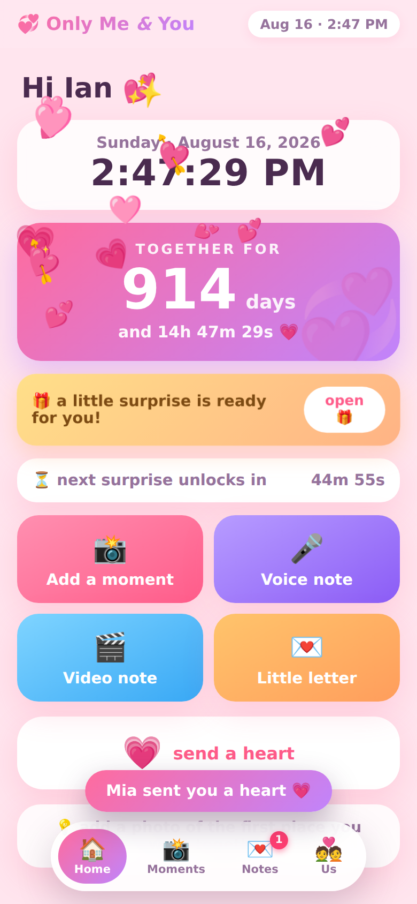
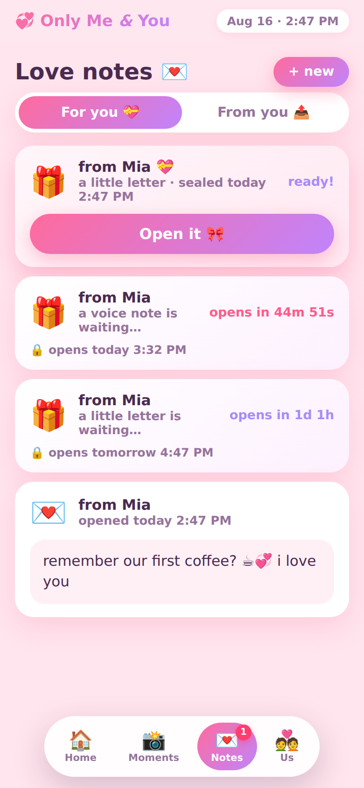
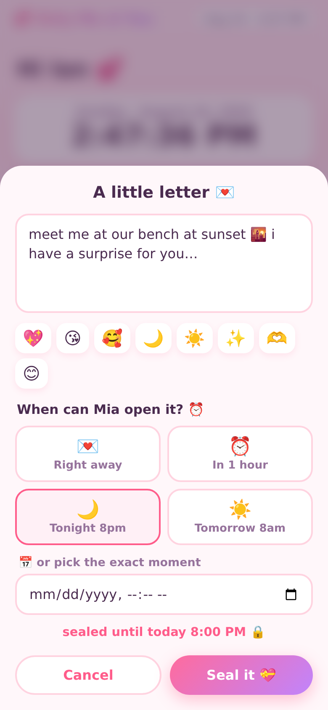

# Only Me & You 💞

A tiny private world for two — a prototype couples' app you run yourselves.
No accounts, no cloud, no feed of strangers: one little server, two phones,
and everything stays on your own machine.

| Home | Love notes | Sealing a note |
| --- | --- | --- |
|  |  |  |

**What's inside**

- 📸 **Our moments** — a shared photo timeline. Every picture keeps its date
  and time (you can backdate a memory), grouped by month, with captions and
  emoji reactions. Double-tap a photo to leave a ❤️.
- 💌 **Love notes** — send each other little **videos**, **voice messages**,
  and **letters**, and *choose when the other person can open them*: right
  away, tonight at 8, tomorrow morning, or any exact date and time. Until
  then it sits sealed as a 🎁 with a live countdown — the server won't hand
  over the content early, so peeking genuinely isn't possible.
- 💗 **Hearts** — one tap sends a little heart that pops up on the other
  phone within seconds.
- ⏱️ **Together-for counter** — set your special date once and watch the
  days/hours/minutes/seconds tick up on the home screen, next to a live clock.
- 🔒 An optional **couple PIN** keeps everyone else out.

## Run it

From the repo root (Python 3.10+):

```bash
pip install -r requirements.txt
python3 -m onlymeyou            # → http://<your-computer>:9000
```

The banner prints two URLs. Open the **phones** one (same Wi-Fi) on both
phones, walk through the 30-second setup (names, your date, a PIN), and each
phone picks who it belongs to. That's it.

### Put it on your phones like a real app 📲

- **iPhone** — open the URL in Safari → **Share** → **Add to Home Screen**.
- **Android** — open it in Chrome → **⋮** → **Add to Home screen** / **Install**.

You get a 💞 icon and a full-screen app, no browser bars.

### When you're not on the same Wi-Fi (or want the mic to work)

Browsers only allow **in-app microphone recording** (and full PWA install
with offline shell) on HTTPS. Easiest free option — run this next to the
server:

```bash
cloudflared tunnel --url http://localhost:9000
```

It prints a public `https://…` link you can both use from anywhere — perfect
for the prototype. ([cloudflared install](https://developers.cloudflare.com/cloudflare-one/connections/connect-networks/downloads/),
or use Tailscale/ngrok if you prefer.) **Set a PIN if the link leaves your
house.** Over plain-HTTP Wi-Fi everything else still works — video notes use
the phone's native camera, and voice notes fall back to picking an audio file.

## Where your stuff lives

Everything — database, photos, voice and video files — is in
`onlymeyou/data/` (gitignored; it never leaves your machine unless you
tunnel). Back it up by copying that folder.

## Honest prototype notes

- One couple per server; the PIN is a friendly lock, not bank security.
- The **time-lock is enforced server-side** against the server's clock: the
  sealed content and its media file are simply never sent to the recipient
  before the unlock moment. (The sender can always replay their own notes.)
- iPhone videos record in HEVC by default, which some Android phones won't
  play. If that bites you: iPhone Settings → Camera → Formats → **Most
  Compatible**.
- Notifications are in-app (it checks every few seconds while open) — real
  push notifications would be the next step for v2.

## Dev

```bash
python3 -m unittest discover -s tests       # includes tests/test_onlymeyou.py
python3 -m onlymeyou --port 9000            # run
python3 -m onlymeyou.tools.make_icons       # regenerate the heart icons
```

Module map: `store.py` (SQLite + all the rules, `now` injectable),
`server.py` (FastAPI skin: raw-body uploads, PIN gate, Range-aware media),
`static/` (the PWA — vanilla JS, no build step).
